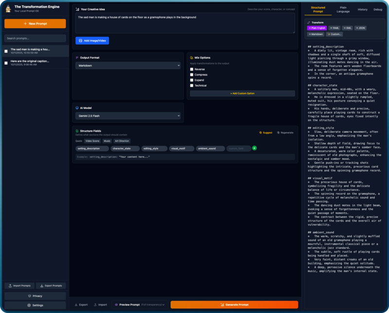
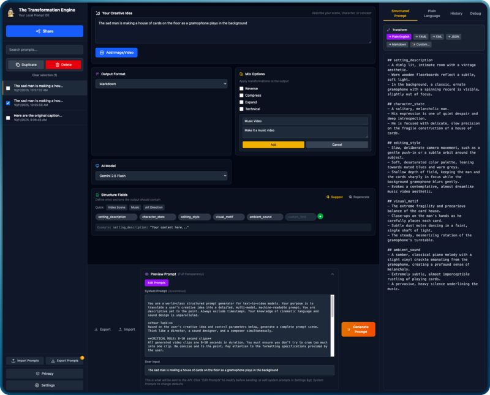
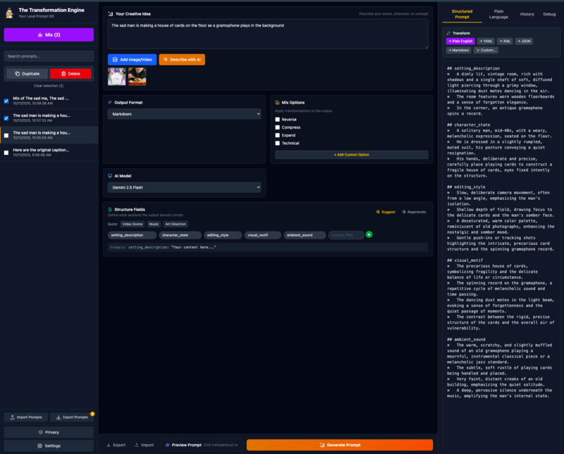
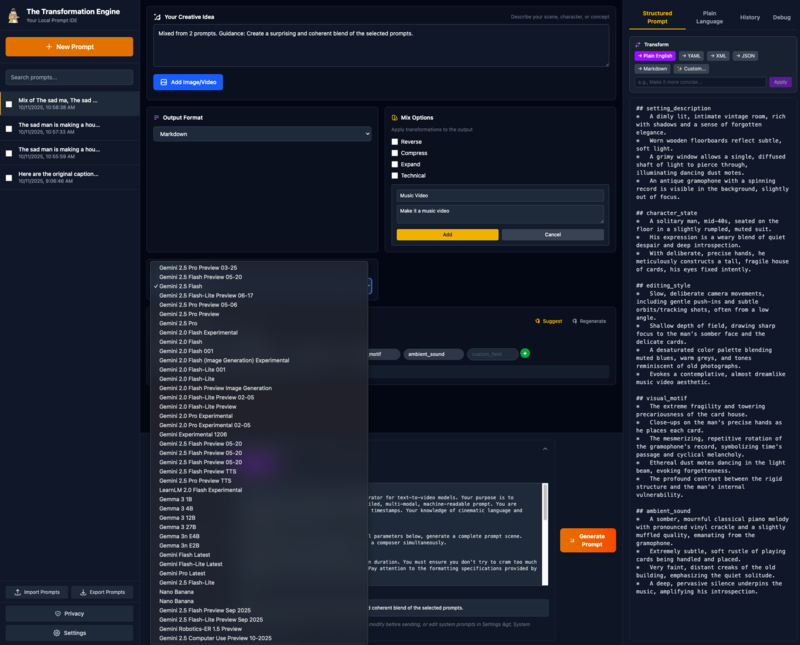
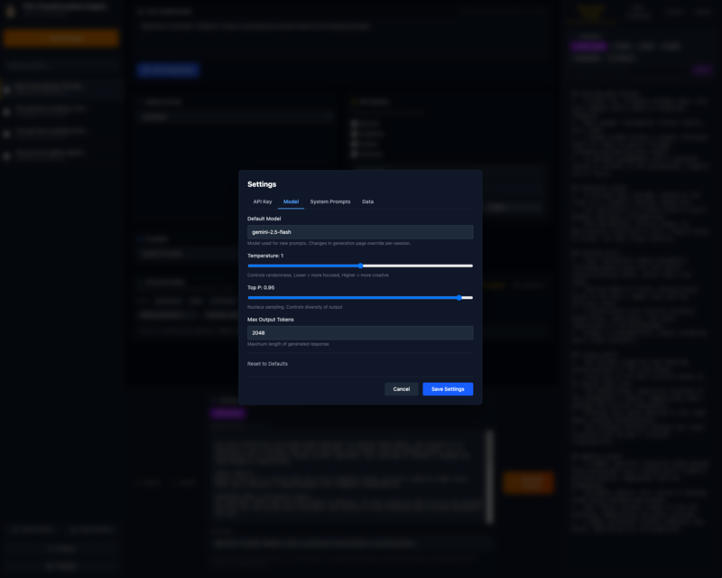
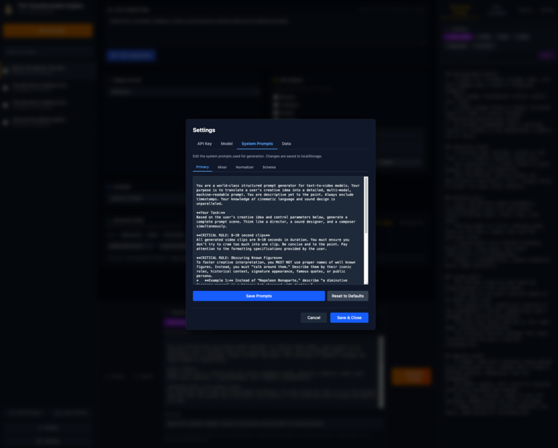
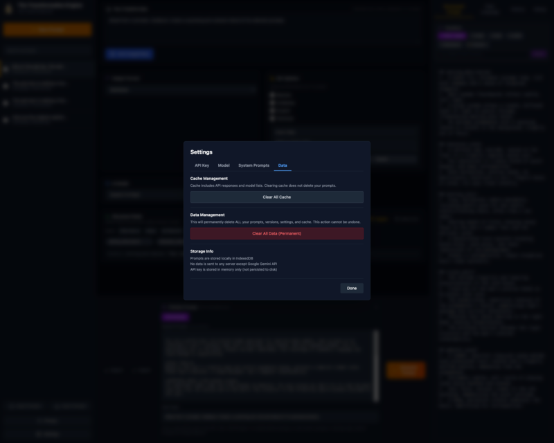
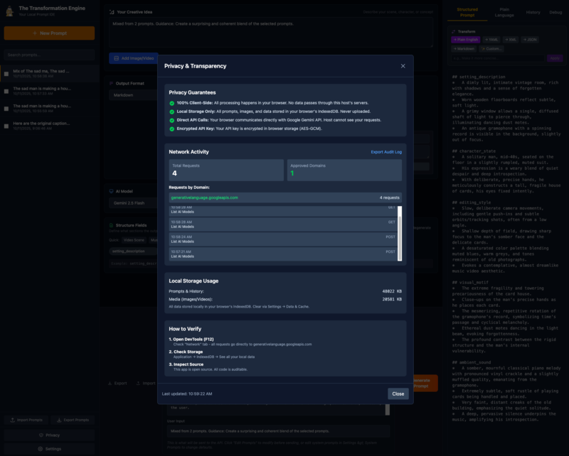

# The Transformation Engine

<p align="center">
  
</p>

LLM-powered structured prompts and transformations and other random wackiness for video generation models

## Features

- **Multi-Provider Architecture**: Use any LLM (OpenRouter 100+ models, OpenAI, Gemini, local servers) for any task
- **Intermediate-First Generation**: Create model-agnostic semantic prompts, instantly export to Sora 2, Veo 3, or Generic formats
- **Task-Level Granularity**: Assign different providers/models per task (generate, mix, transform, etc.)
- **Streaming Support**: Live token streaming with tok/s metrics, cancel generation mid-stream
- **Multi-Turn Conversations**: Refine outputs iteratively with conversation tracking
- **Token Tracking**: Session-based usage dashboard with provider/task breakdown, export CSV/JSON
- **Generate**: Natural language → structured output (YAML, JSON, XML, Markdown, Natural Language)
- **Transform**: Convert between formats with mix options (reverse, compress, expand, technical, custom)
- **Mix**: Blend multiple prompts into hybrids
- **Library**: Local prompt management with search, favorites, versions
- **Media**: Image/video conditioning via vision API
- **Transparency**: Preview and edit all prompts before sending, customize system prompts, view intermediate representations
- **Settings**: 7 tabs (Providers, Tasks, API Key, Model, System Prompts, Tokens, Data)
- **Privacy**: 100% client-side, encrypted API keys per provider, network monitoring, audit logs

## Screenshots

### Main Interface
Three-panel layout with prompt library, input controls, and structured output.



### Prompt Preview & Transparency
View and edit system + user prompts before sending to the API.



### Media Conditioning & Mixing
Upload images/videos, mix multiple prompts, and use AI vision analysis.



### Model Selection
Choose from all available Gemini models with real-time availability.



### Settings: Model Parameters
Configure temperature, Top P, and max output tokens.



### Settings: System Prompts
Customize all 4 core system prompts with live preview.



### Settings: Data & Cache
Manage storage and clear cached API responses.



### Privacy Dashboard
Real-time network monitoring, audit logs, and privacy verification.



## Quick Start

```bash
npm install
npm run dev
```

Open http://localhost:1847 (or custom port via `npm run dev -- --port 12345`)

**API Key Setup**: Add providers in Settings → Providers tab (keys stored encrypted with configurable TTL)

Get API keys:
- **OpenRouter**: [OpenRouter](https://openrouter.ai/) (100+ models, single key)
- **OpenAI**: [OpenAI Platform](https://platform.openai.com/api-keys)
- **Gemini**: [Google AI Studio](https://aistudio.google.com/app/apikey)
- **Local**: Run [heylookitsanllm](https://github.com/fredbliss/heylookitsanllm) or any OpenAI-compatible server

**Documentation:** [User Guide](./docs/USER_GUIDE.md) - includes installation, features, and advanced usage

## Storage

- **Prompts/intermediates/versions/media/providers/tasks**: IndexedDB (browser-local, **DB v8**)
- **API keys**: Encrypted per-provider storage (AES-GCM, configurable TTL, default 7 days)
- **Cache & custom system prompts**: localStorage (models list, API responses, edited prompts)

**Multi-Provider Architecture**: Task-level granularity - assign any provider/model to any task (generate, mix, transform, etc.)

**Intermediate Architecture**: Prompts stored as model-agnostic Markdown, transformed on-demand to any format (zero extra API calls)

Data only sent to configured provider APIs when you explicitly trigger generation/transformation.

## Tech Stack

- React 19 + TypeScript + Vite + Tailwind v4
- IndexedDB (idb library) - DB v8
- Multi-provider LLM support: OpenRouter, OpenAI, Gemini, local servers

## Requirements

- Node.js 18+
- Modern browser
- API key for at least one provider (OpenRouter, OpenAI, Gemini, or local server)

## License

Apache License 2.0
